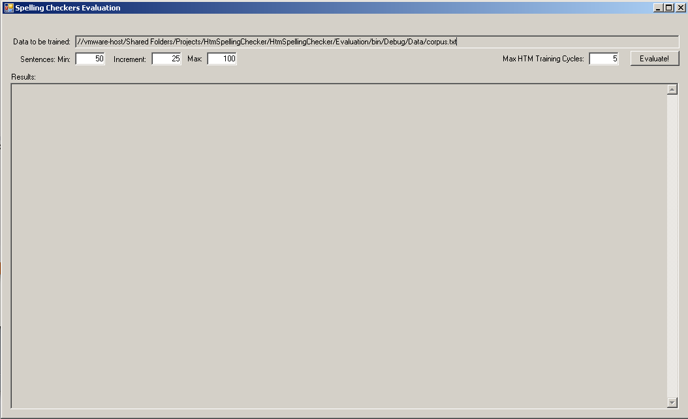

# HtmSpellingChecker

HtmSpellingChecker is an experimental spelling checker using machine learning (in special, HTM neural networks) as approach and was the theme of my master's degree dissertation (which earned me an A+ grade).
Basically you train the network with a set of real world texts. After that, you give it a sentence to analyse, and if find an anomaly (ie a mispelling word) it suggest the best correction based on prediction.

Most spelling checkers on the market (including those used by search engines like Google or text editors like MS-Word), often provide correction suggestions based merely on orthographic similarity. However this is a critical problem when they present suggestions of corrections that do not make sense in current context or when the spelling checker ignores misspelled words because such words exist in its dictionary.

In English language, for example, if someone writes "I lite", we simply deduce that such person has committed a typo because this statement makes no sense to us. That leaves us to consider if they wanted to use the words "like" or "live". Such a sentence "as is" does not help us to give a satisfactory and accurate solution to the user. We would have to have more words in the sentence to we correctly guess which would be the best word for a given context. 
So in the above example, suppose we have two sentences: "I lite in New York" and "I lite New York". Taking into account that the preposition "in" does not fit well into the concept of "like", the former sentence would make more sense if it was "I live in New York" and the latter one was: "I like New York."

That said, we would not be surprised to know that in this subfield of NLP, the analysis of the context is the "holy grail" of any efficient spelling checker. Thus, I choosed the HTM neural network as main engine for the spelling checker. 

The HTM checks the probability behaving in a Bayesian way to predict the next input as new data arrives, i.e. its predictions are not based on rules. Furthermore, it can make predictions over a greater range of words. For example, while N-Grams can only analyze the context up to n-1 words, an HTM neural network could predict a word in particular even for an entire sentence.

## Technical details

The proposed system was written the in C#, as it compiles source to managed code and also is a cross-platform language. Both the C# compiler and editor are freely provided by Mono open-source community.
In addition to the subprojects that compose the proposed system, three additional subprojects were created: one to implement the Levenshtein Distance algorithm, another to implement N-Grams algorithm, and a subproject called Evaluation, with the sole intention of comparing all three methods discussed in this dissertation. As the engines of the three methods use components in common (dictionaries and text manipulation), one subproject ‘Common’ was created only to accommodate the components to be shared. All these subprojects were written in same language and platform in order to avoid wrappers and isolate performance issues.

## Installation

Currently supported platforms:
 * Windows
 * Linux
 * Mac OSX

Required tools:
 * [Mono 3.2.3](http://www.mono-project.com) or [.Net 4](http://www.microsoft.com/net) framework
 * [MonoDevelop](http://monodevelop.com/Download) or [Visual Studio](http://www.visualstudio.com/) IDE

## Running from the IDE:

 * Open the IDE executable.
 * Open 'HtmSpellingChecker.sln' solution file located on <code>/Source</code> folder.
 * Click 'Run'.

## Run the tests:

    

 * Specify the data to be trained and tested. The text should not have graphic accentuation and sentences should have more than 3 words.
 * Specify the range of sets to be tested. For example, if minimum number of sentences is 50, maximum number is 200, and size/increment for each set is 50, then we will have sets with 50, 100, 150, and 200 sentences respectivelly.
 * Click 'Evaluate'.

## Understanding the results:

The tests consist of trainning 3 engines (HTM, Levenstein Distance, and N-Gram) with a corpus containing well written sentences and then test them with mispelled sentences created from the first corpus. These mispelled sentences will have at least one word that suffered an modification (insertion, deletion, replacement or transposition of characters).

Two variables will be calculated and shown:
 * Performance: in other words, is the total time that each engine takes to evaluate and return the list of corrections for a set.
 * Accuracy: is the percentage of correct suggestions returned by an engine over the real number of issues created.
